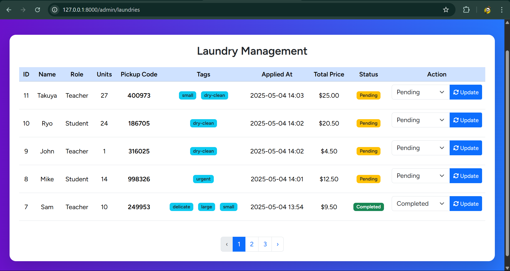
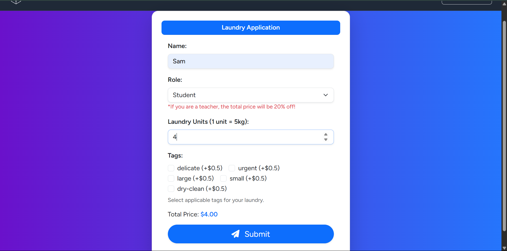
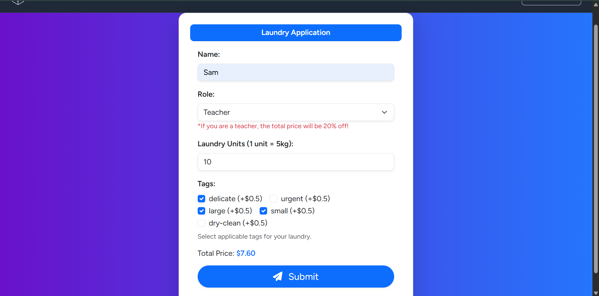
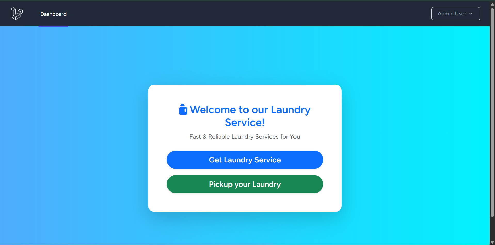
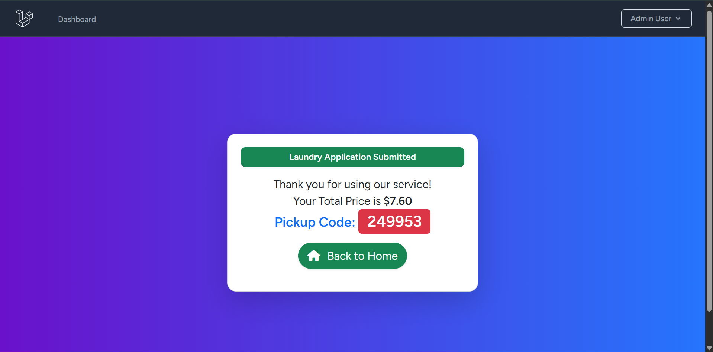
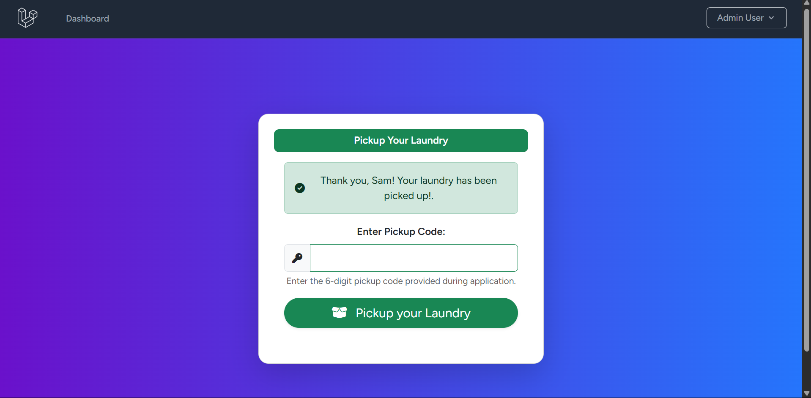
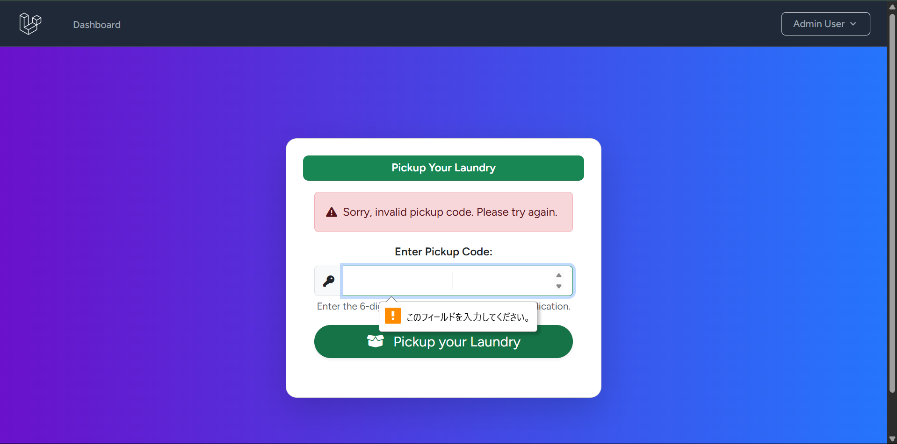
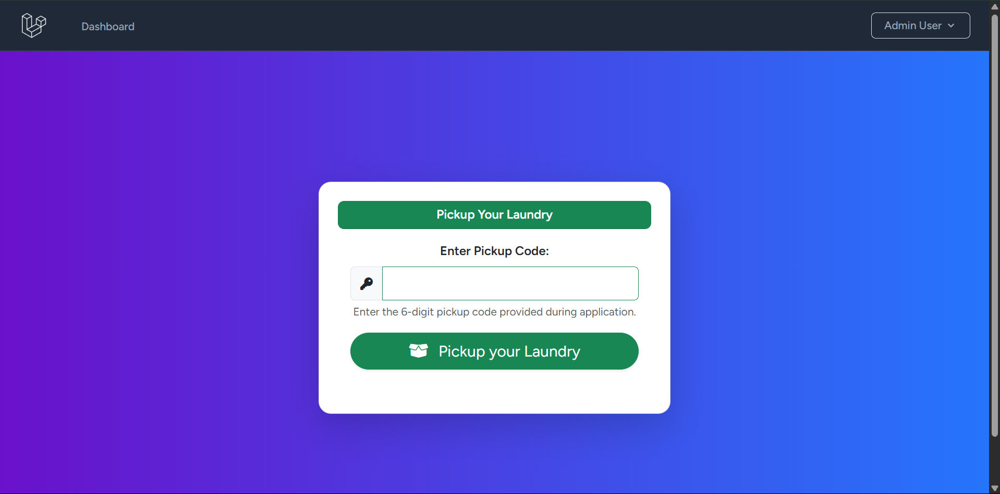

# 🧺 Laundry Management App

This is a Laravel-based web application for managing laundry services. It includes features for students and teachers to create laundry requests, receive pickup codes, view the dashboard, and for administrators to manage orders and pricing.

---

## 🚀 Features

- User Roles: `Admin`, `Student`, `Teacher`
- Create and manage laundry requests
- Automatic pickup code generation
- Status management: `Pending`, `Completed`
- Price calculation by unit
- Admin panel for managing requests and pricing
- Responsive UI with screenshots below

---

## 🧑‍💻 Technologies

- Laravel (PHP Framework)
- MySQL
- Bootstrap (UI)
- JavaScript
- Blade Templating Engine

---

## 📸 Screenshots

| Feature                | Screenshot                                |
| ---------------------- | ----------------------------------------- |
| Admin Dashboard        |          |
| Create Laundry Request |        |
| Change Price (Admin)   |  |
| Dashboard View         |  |
| Get Pickup Code        |    |
| Code Match Success     |     |
| Code Mismatch          |  |
| Pickup Confirmed       |        |


---

## ⚙️ Setup Instructions

```bash
git clone https://github.com/your-username/laundry-app.git
cd laundry-app
composer install
cp .env.example .env
php artisan key:generate
# Set your DB credentials in the .env file
php artisan migrate --seed
php artisan serve
